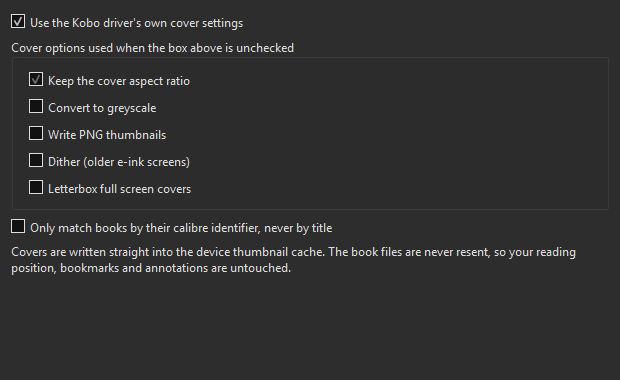

# Kobo Cover Pusher

A calibre plugin that writes the covers from your library **straight into the
thumbnail cache of a connected Kobo**, without resending the book files.

Requires calibre 6 or later, and a Kobo driven by calibre's KoboTouch driver.

## The problem

A Kobo does not read the cover out of the EPUB. It shows thumbnails it
generated once and stored in `.kobo/images/`, so changing a cover in calibre
changes nothing on the device.

The usual fix is to enable *Upload covers for books* in the driver and send
the books again. That works, but it rewrites the book files, and it is a lot
of transferring for what is only a picture.

This plugin writes the thumbnails and nothing else. **Your reading position,
bookmarks and annotations are untouched**, because the files they point at are
never replaced.

## Usage

Connect the Kobo, wait for calibre to show it, open the device view once so
calibre reads the device library, then go back to your library, select the
books and use the **Kobo Covers** toolbar button.

| Menu entry | What it does |
|---|---|
| **Push covers for the selected books** | writes the thumbnails for every selected book found on the device |
| **Device information…** | model, firmware, paths, how many books calibre sees, and the exact thumbnail sizes for your model |
| **Settings…** | cover options and how books are matched |

Eject the Kobo afterwards and let it finish its library scan to see the new
covers.

## How books are matched

A library book is paired with the copy on the device by, in order:

1. the calibre identifier stored on the device — exact, and survives renaming;
2. title **and** author, ignoring case, accents and punctuation, so
   `Le dernier jour d'un condamne` finds `Le dernier jour d’un condamné`;
3. title alone, but **only when that title is unique on the device**.

Two different books sharing a title are never guessed at: they are reported as
skipped. If you would rather only ever match on the calibre identifier, there
is a setting for that; it is safer, but it skips books that reached the Kobo
by any route other than calibre.

## And the metadata? (title, author, tags, description)

This plugin writes **covers**. The rest of the metadata is handled by calibre
itself, and the switch is off by default, which is why a Kobo keeps showing
the old author after you fixed it in calibre.

With the Kobo connected: **Preferences → Plugins → Device interface →
KoboTouch → Customize**, tab **"Metadata, on device && advanced"**:

- **"Update metadata on the device"** — the master switch for the group;
- **"Update metadata on Book Details pages"** — the one that actually pushes
  title, author, publisher and description into the device database. **This is
  the one that ships off**;
- **"Set series information"** — series and volume number in the Kobo book
  lists, which the device cannot read from a sideloaded file on its own.

calibre then updates the device database **when the device connects**, so
reconnect the Kobo once and let it work. The books are not resent.

Order that works: fix everything in calibre, tick the options above, push the
covers with this plugin, eject, reconnect once.

## Settings

By default the plugin reuses the Kobo driver's own cover options (aspect
ratio, greyscale, PNG, dithering), so what it writes matches what calibre
would have written when sending a book. Untick that box to decide here
instead — useful if you want to keep the aspect ratio for pushed covers
without changing how sending behaves.

## Limits

- It only knows Kobo. The button reports a clear error on any other device.
- It writes the thumbnails; it does not add books, and it will not create a
  cover for a book that is not already on the device.
- A book with no cover in calibre is skipped rather than blanked on the
  device.
- It builds on the KoboTouch driver rather than reimplementing the Kobo image
  format, which keeps it correct across models but ties it to a calibre
  internal (`_upload_cover`). If a future calibre removes it, the plugin says
  so plainly instead of failing obscurely.

## Licence

GPL-3.0, like calibre itself. Internals in [DEVELOPING.md](../DEVELOPING.md).
