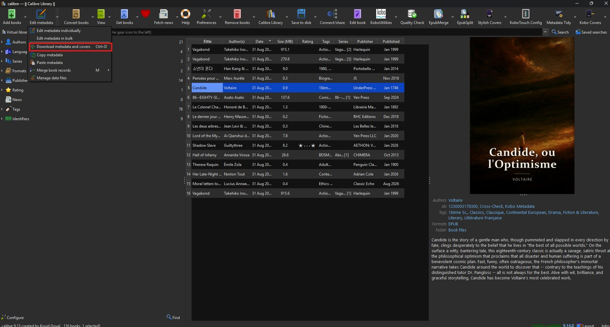
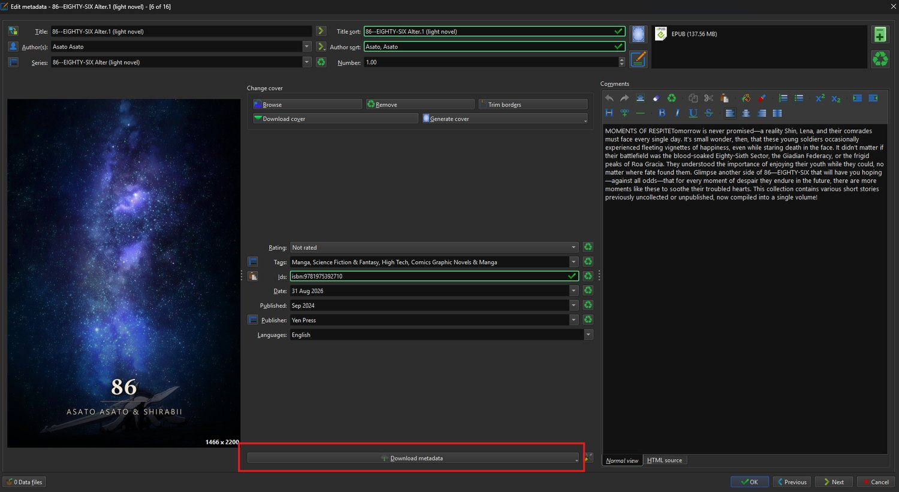
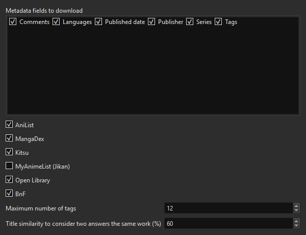

# Cross-Check

A calibre **metadata source** that queries several free APIs at once, compares
what they say, and hands the result to the *Download metadata* dialog you
already use.

No API key, no account, no configuration needed to start.

Requires calibre 6 or later. Tested on calibre 9.13 under Windows 11.

## Why

The sources calibre ships answer well for published books and badly for manga,
light novels and web novels. Asked about *Lord of the Mysteries*, Amazon
offers **Love the Food that Loves You Back**, a diet cookbook.

Cross-Check answers:

| | |
|---|---|
| Title | Lord of the Mysteries |
| Original title | 诡秘之主 |
| Author | Ai Qianshui de Wuzei |
| Year | 2020 |
| Tags | Action, Drama, Fantasy, Mystery, Thriller |
| Confirmed by | AniList, MangaDex, Kitsu |

And it does not lose the books calibre already handled: *Le colonel Chabert*
comes back as **Honoré de Balzac**, accent included, confirmed by the BnF and
Open Library.

## The sources

| Source | Covers | On by default |
|---|---|---|
| **AniList** | manga, manhwa, manhua, light novels, web novels — with native titles | yes |
| **MangaDex** | manga and manhwa, many titles per language | yes |
| **Kitsu** | manga and light novels, a useful second opinion | yes |
| **MyAnimeList** (through Jikan) | manga and light novels | no — it frequently answers HTTP 504 |
| **Open Library** | published books: authors, year, publisher, subjects, ISBN | yes |
| **BnF** | the French national library: french editions and small french publishers | yes |

Google Books is deliberately absent: without an API key it answers HTTP 429
from a shared anonymous quota, so it would fail more often than it helps.

## How the cross-check works

All sources are queried in parallel. Answers describing the same work are
grouped, even when they spell it differently — `86: Eighty Six`,
`86—EIGHTY-SIX` and `86 EIGHTY SIX` are one work, and so are `Gu Zhenren` and
`Gu Zhen Ren`.

Within a group:

- **title, author, year, publisher, native title**: the value the most
  sources agree on;
- **tags**: the union of all of them, capped, so you prune rather than hunt;
- **description**: the longest one, being the most informative;
- **language**: voted on rather than merged, so a spanish and a french edition
  in the results do not make a japanese manga trilingual.

Each result carries a line saying who confirmed what:

```
Cross-check: 5 source(s) - AniList, BnF, Kitsu, MangaDex, Open Library.
Agreed on: languages, native_title, title, year.
```

**Nothing is dropped for lack of consensus.** A field a single source knows is
still filled in — you review everything in calibre's dialog anyway. Agreement
only decides which result is offered first and what that line says. The one
exception is noise: a result backed by a single source whose title has almost
nothing in common with what you searched is discarded.

## Usage

Cross-Check is a **metadata source**, not a toolbar button: it will never add
an icon. It works inside the download you already use.

1. **[Download metadata-crosscheck.zip](https://github.com/zixload/calibre-plugins/releases/download/metadata-crosscheck-v1.0.0/metadata-crosscheck.zip)** (v1.0.0),
   then in calibre: **Preferences → Plugins → Load plugin from file**. Pick the
   ZIP and **restart calibre**.
2. **Preferences → Sharing → Metadata download**: *Cross-Check* appears in the
   source list, ticked. In the plugin list of Preferences it sits under
   *Metadata source*, not under *User interface action*.
3. Select books, then **Edit metadata → Download metadata and covers**
   (`Ctrl+D`).



<sub>The entry sits in the dropdown next to the *Edit metadata* button. The
three toolbar buttons on the right — Stylish Covers, Metadata Tidy, Kobo
Covers — are the other plugins of this repository.</sub>

What happens next depends on the selection:

- **one book**: calibre lists the matches it found, you pick one, you see the
  merged result, you validate. Nothing is written before that;
- **several books**: it runs as a background job, and the dialog at the end
  offers **Review downloaded metadata**. Use it — that is where you catch a
  web novel that came back as a cookbook.

You can also work book by book: **Edit metadata individually** has its own
**Download metadata** button at the bottom, which fills the form in front of
you so you see exactly what changes before clicking OK.



<sub>A light novel filled in by the download: series and number, tags, ISBN,
publisher, publication date and the full synopsis. The cover came with it.</sub>

On the same preferences screen, two settings are worth changing:

- **untick Rating**: what sources return is a public average, not your
  opinion, and it overwrites yours;
- **untick "Prefer fewer tags"** if you want the merged tags. Cross-Check
  unions the tags of every source, and that box makes calibre keep only a few.

A full search takes about **3 seconds** across five APIs.

## Settings



**Preferences → Metadata download → Cross-Check → Configure selected source**:
tick the APIs to query, cap the number of tags, and set how similar two titles
must be to count as the same work.

The original title appears at the top of the description, so it can be copied
into a column such as `#original_title` — which
[Stylish Cover Generator](../stylish-cover-generator/) reads for its Asian
subtitle.

## Licence

GPL-3.0, like calibre itself. Internals in [DEVELOPING.md](../DEVELOPING.md).
