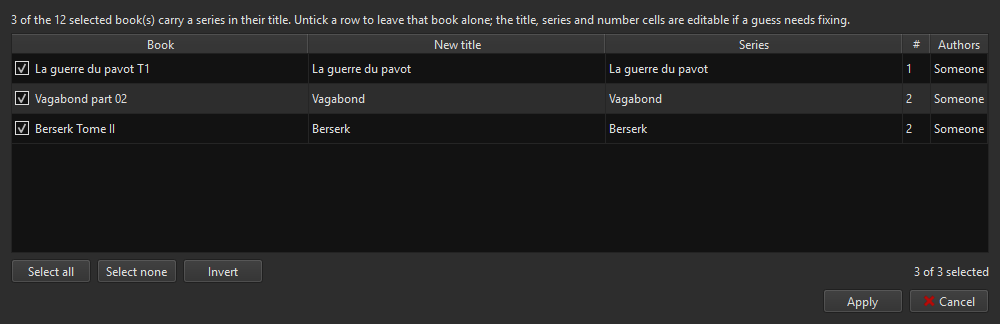
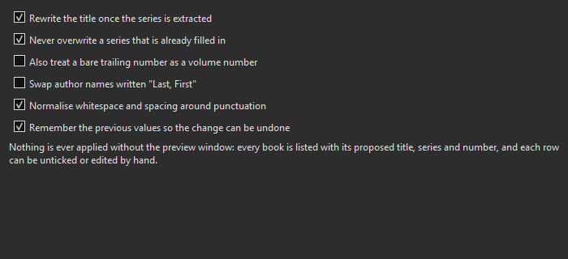

# Metadata Tidy

A calibre plugin that pulls the **series name and the volume number out of
book titles** that carry them, and fills the Series and Series index fields —
so sorting, grouping and cover generation finally have something to work with.

Requires calibre 6 or later. Tested on calibre 9.13 under Windows 11.

## The problem

Books imported from almost anywhere arrive like this:

```
La guerre du pavot T1
La Guerre du pavot, Livre 2 : La République du Dragon
Vagabond part 02
86—EIGHTY-SIX: Alter, Vol. 1: The Reaper's Occasional Adolescence
```

The series is right there in the title, but the Series field is empty, so
calibre cannot sort the volumes, group them, or print the series on a cover.

## What it does



Nothing is ever written without that window. Every book is listed with what it
would become, each row can be unticked, and the title, series and number cells
are editable if a guess needs fixing.

| Title | becomes | Series |
|---|---|---|
| `La guerre du pavot T1` | La guerre du pavot | La guerre du pavot #1 |
| `La Guerre du pavot, Livre 2 : La République du Dragon` | La République du Dragon | La guerre du pavot #2 |
| `Vagabond part 02` | Vagabond | Vagabond #2 |
| `86—EIGHTY-SIX: Alter, Vol. 1: The Reaper's…` | The Reaper's… | 86—EIGHTY-SIX: Alter #1 |
| `The Poppy War (The Poppy War #1)` | The Poppy War | The Poppy War #1 |
| `Berserk Tome II` | Berserk | Berserk #2 |

Recognised in french and english: `T1`, `T. 12`, `Tome 3`, `Livre 2`, `Vol. 1`,
`Volume 3`, `part 02`, `Partie 2`, `Book 4`, `#5`, `n° 7`, roman numerals, and
half volumes like `Vol. 1.5`.

**It refuses to guess.** A title with no volume marker is left strictly alone,
and a bare trailing number is ignored by default — *Fahrenheit 451* and
*Catch 22* are not volume 451 and 22 of anything.

Two spellings of the same series are unified before anything is written
(`La guerre du pavot` and `La Guerre du pavot` become one series), because
calibre merges series names case insensitively anyway. The spelling of volume 1
is the one kept.

## Settings



| Option | Default | Effect |
|---|---|---|
| Rewrite the title once the series is extracted | on | off keeps titles as they are and only fills the series |
| Never overwrite a series already filled in | on | protects series you set by hand |
| Treat a bare trailing number as a volume number | **off** | risky: turns "Dune 2" into a volume, but also mangles "Fahrenheit 451" |
| Swap author names written "Last, First" | off | `Hugo, Victor` becomes `Victor Hugo`, leaving `Smith, Jr.` alone |
| Normalise whitespace and punctuation spacing | on | collapses double spaces, fixes ` ,` |
| Remember previous values | on | required for **Undo last tidy** |

## Why not just download the metadata?

Because no online source knows how your files are organised.

Asked about *Vagabond*, AniList, MangaDex and Kitsu all answer with the work
as a whole: one manga, no volume. None of them returns a series **and** a
volume number, verified on *Vagabond*, *86—EIGHTY-SIX* and *La guerre du
pavot* — all three came back with an empty series field.

That information exists in exactly one place: your own titles, because you are
the one who split the books into files.

**So run this plugin before downloading metadata**, not after. A metadata
download rewrites the title, so `Vagabond part 02` becomes `Vagabond` and the
volume number is gone for good. Extract it first, and the download then fills
authors, tags and description around a series that is already correct.

## Installation

1. **[Download metadata-tidy.zip](https://github.com/zixload/calibre-plugins/releases/download/metadata-tidy-v1.0.0/metadata-tidy.zip)** (v1.0.0).
2. In calibre: **Preferences → Plugins → Load plugin from file**, and pick the
   ZIP.
3. calibre asks which toolbars to add the button to; accept.
4. **Restart calibre.**

## Usage

Select some books, then use the **Metadata Tidy** toolbar button.

| Menu entry | What it does |
|---|---|
| **Tidy selected books…** | opens the preview, applies what you keep |
| **Undo last tidy** | puts back the titles, series and authors from the last run, even after a calibre restart |
| **Create the #original_title column…** | adds a text column for the original chinese, korean or japanese title — this is the column [Stylish Covers](../stylish-covers/) reads for its Asian subtitle |
| **Settings…** | which fixes are proposed |

## Where things are stored

Settings live in `%APPDATA%\calibre\plugins\metadata_tidy.json`, and the undo
data in `%APPDATA%\calibre\plugins\metadata_tidy_undo.json`. Only the last run
is kept, per library.

## Licence

GPL-3.0, like calibre itself. Internals and the rule format are covered in
[DEVELOPING.md](../DEVELOPING.md).
