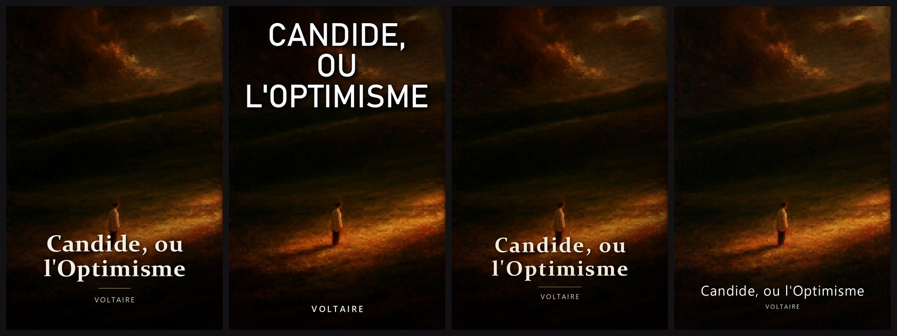
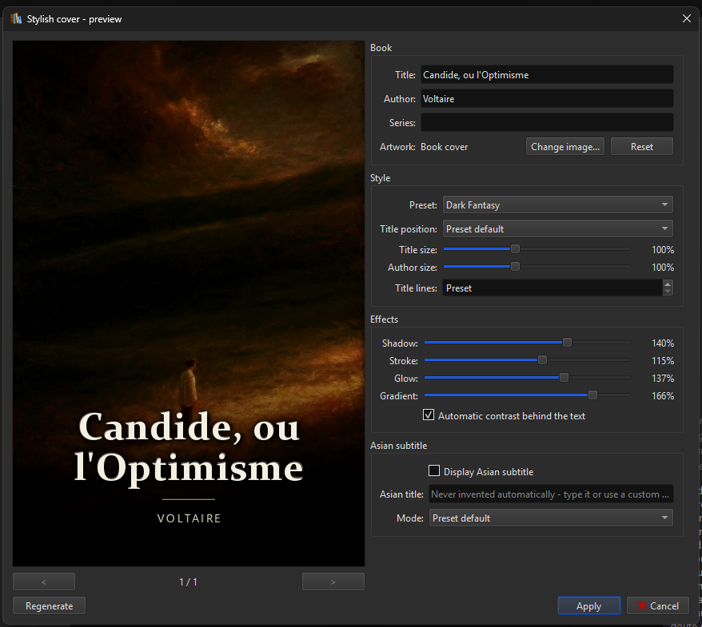
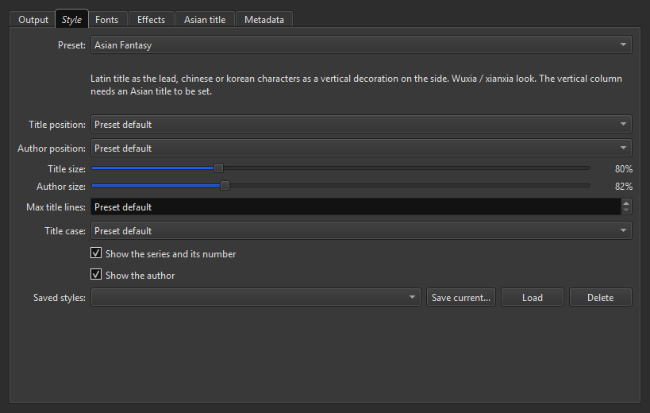
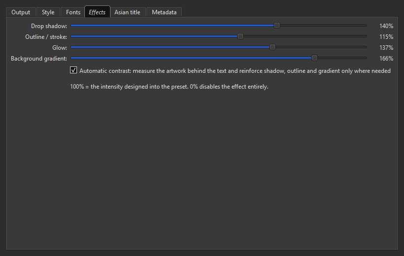

# Stylish Cover Generator

A calibre plugin that builds real webnovel / dark fantasy covers out of the
artwork a book already has (or any image on your disk) and its metadata, then
saves the result as the book cover.

Requires calibre 6 or later. Tested on calibre 9.13 under Windows 11.

## Examples

One illustration, the same metadata, the four presets at their default
settings.

<table>
<tr>
<td width="45%"></td>
<td>

The `dark_fantasy` preset over a light, textured background: automatic
contrast measured the luminance behind the text block and reinforced the
shadow and the gradient, without darkening the illustration itself.

The title split itself across three balanced lines, and the gold rule
separates it from the author.

</td>
</tr>
</table>

The preview window: instant render on the left, metadata and quick
settings on the right.

## What it does

| Preset | Look |
|---|---|
| **Dark Fantasy** | artwork dominant, serif title in the lower third, gold rule, soft shadow |
| **Shadow Slave** | huge title at the top, bold type, light outline, pronounced drop shadow, author at the bottom |
| **Asian Fantasy** | latin title at the bottom, chinese/korean characters in a vertical column on the side (wuxia / xianxia) |
| **Minimal** | clean title, author, almost no effects, absolute priority to the illustration |

- **your artwork is never distorted** — it is scaled to cover the canvas then
  cropped, never stretched;
- **2:3 output**, 1600 × 2400 px by default;
- **the title sizes itself**: the largest size that fits in 1, 2 or 3 lines,
  with balanced line breaks, and words are never cut in half;
- **automatic contrast**: the plugin measures the brightness of the artwork
  *behind each block of text* and reinforces the shadow, outline and gradient
  only where they are needed, so light illustrations stay readable without
  being flattened;
- **chinese, korean and japanese** are fully supported, including a vertical
  column of characters;
- **nothing is lost**: the cover you replace is kept, and one menu entry puts
  it back.

## Installation

1. **[Download stylish-cover-generator.zip](https://github.com/zixload/calibre-plugins/releases/download/stylish-cover-generator-v1.0.2/stylish-cover-generator.zip)** (v1.0.2).
2. In calibre: **Preferences → Plugins → Load plugin from file**, and pick the
   ZIP.
3. Accept adding the button to the toolbar, then **restart calibre**.

Nothing else to install: everything the plugin needs already ships with
calibre, and it never touches the network.

## Usage

Select one or more books, then use the **Stylish Covers** toolbar button.

| Menu entry | What it does |
|---|---|
| **Generate stylish covers** | generates straight away with your saved settings, for every selected book, with a cancellable progress bar |
| **Preview…** | opens the preview window (also what a plain click on the button does) |
| **Generate from a chosen image…** | asks for an image on disk and uses it as the artwork instead of the current cover |
| **Restore previous cover** | puts back the cover replaced by the last generation |
| **Restore original cover** | puts back the cover from before the very first generation |
| **Settings…** | opens the configuration |

### The preview window

The preview renders instantly and uses exactly the same engine as the final
cover, so what you see is what gets saved.

- title, author, series and Asian title are editable **for that render only**,
  without touching your library metadata;
- **Change image…** swaps the artwork for any file on your disk, **Reset**
  goes back to the book cover;
- `<` and `>` walk through your selection;
- **Apply** applies to the displayed book, **Apply to all** to the whole
  selection.

### Batch mode

**Generate stylish covers** processes the whole selection, asking for
confirmation past 5 books. Every replaced cover is backed up first, so a
botched batch is undone with **Restore previous cover** on the same selection
— even after a calibre restart.

Budget roughly half a second per cover.

## Settings

The **Style** tab picks the preset and lets you nudge the title position and
sizes; **Effects** holds the four intensity sliders and the automatic contrast
switch, every value being a multiplier on what the preset was designed with —
100 % is the preset as drawn, 0 % disables the effect.

## Fonts

No font ships with the plugin, for licensing reasons. By default it picks a
suitable font already installed on your system, and that works out of the box.

To use your own: **Settings → Fonts**, then pick any `.ttf` or `.otf` file for
the title, the author, or the chinese/korean/japanese text. **Check fonts**
reports what is actually in use.

Fallback is automatic: a character missing from your title font — an ideograph
inside a latin title, say — is drawn with the CJK font instead of showing an
empty box.

## Asian subtitle

**Settings → Asian title** adds a second title in chinese, korean or japanese,
horizontally under the author or vertically down the side.

**No translation is ever invented.** The text comes either from a calibre
column you filled in yourself (`#original_title` by default) or from what you
type in the settings or the preview window.

## Saving your own look

Once you like a combination of preset, positions, sizes and effect
intensities, **Settings → Style → Saved styles → Save current…** stores it
under a name you choose, and **Load** brings it back. Handy to keep one look
per collection.

## Where things are stored

Settings live in `%APPDATA%\calibre\plugins\stylish_cover_generator.json`, and
the backed up covers in
`%APPDATA%\calibre\plugins\stylish_cover_generator_backups\`. Previous covers
are capped at 800 files; original covers are never deleted.

## Licence

GPL-3.0, like calibre itself. Building it from source and the internals are
covered in [DEVELOPING.md](../DEVELOPING.md).
